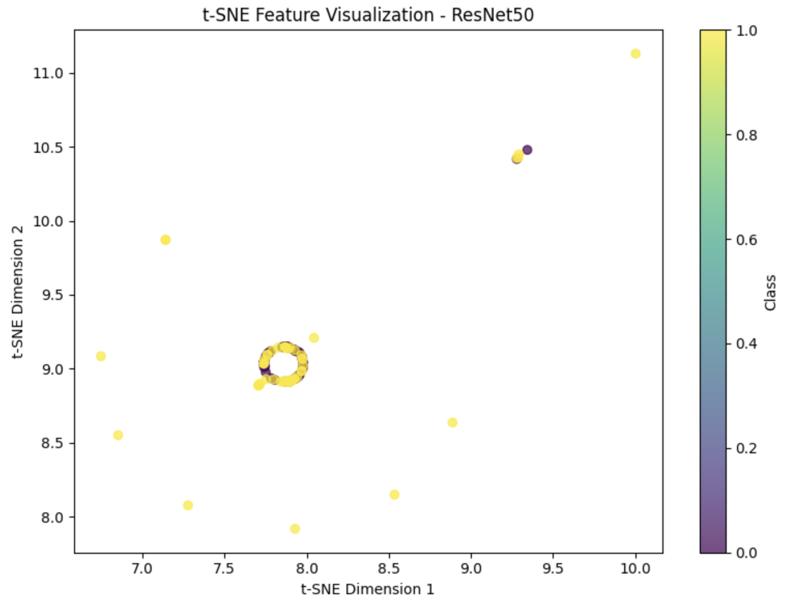

# CNN Architecture Benchmarking for Pet Image Classification

## Overview

This capstone project benchmarks multiple Convolutional Neural Network (CNN) architectures for binary pet image classification using a Cats vs. Dogs dataset.

The project compares a custom CNN model against transfer learning architectures including VGG16, ResNet50, and EfficientNetB0. The goal is to evaluate model performance, training behavior, classification accuracy, and feature representation quality.

---

## Project Objectives

* Build a custom CNN architecture from scratch
* Apply transfer learning using pretrained CNN models
* Compare multiple CNN architectures
* Evaluate training accuracy, validation accuracy, loss, and confusion matrices
* Extract learned features from CNN models
* Visualize feature embeddings using t-SNE
* Identify architecture trade-offs for image classification tasks

---

## Dataset

The dataset contains labeled cat and dog images.

### Dataset Validation Results

| Class | Valid Images |
| ----- | -----------: |
| Cats  |          349 |
| Dogs  |          348 |
| Total |          697 |

The image files were validated before training to ensure the dataset contained usable image data.

---

## Dataset Split

The dataset was split into training, validation, and test sets.

| Class | Train | Validation | Test | Total |
| ----- | ----: | ---------: | ---: | ----: |
| Cats  |   236 |         60 |   53 |   349 |
| Dogs  |   236 |         59 |   53 |   348 |

---

## Data Augmentation

Data augmentation was applied to improve model generalization and reduce overfitting.

Augmentation techniques included:

* Rotation
* Width shifting
* Height shifting
* Zooming
* Horizontal flipping
* Brightness variation

---

## Models Evaluated

### 1. Custom CNN

The custom CNN was built from scratch and used as the baseline model.

The architecture included:

* Convolutional layers
* Max pooling layers
* Dense layers
* Dropout regularization
* Softmax output layer

---

### 2. VGG16 Transfer Learning

VGG16 was used as a pretrained transfer learning model. The model leveraged ImageNet-trained feature extraction layers and added a custom classification head for cat and dog classification.

---

### 3. ResNet50 Transfer Learning

ResNet50 was evaluated as a deeper CNN architecture using residual connections. Feature embeddings were extracted and visualized to evaluate representation learning.

---

### 4. EfficientNetB0 Transfer Learning

EfficientNetB0 was included as an efficient transfer learning architecture designed to balance model depth, width, and input resolution.

---

## Evaluation Metrics

Models were evaluated using:

* Training accuracy
* Validation accuracy
* Training loss
* Validation loss
* Confusion matrix
* Weighted F1-score
* Parameter count
* Feature sparsity
* Activation statistics
* t-SNE feature visualization

---

## Visualizations

### Dataset Validation

.png)

---

### Data Augmentation Examples

.png)

---

### Simple CNN Training Accuracy

.png)

---

### Simple CNN Loss and Confusion Matrix

.png)

---

### Confusion Matrix

.png)

---

### VGG16 Training Results


---

### t-SNE Feature Visualization


---

### ResNet50 t-SNE Feature Visualization



---

## Results Summary

The custom CNN successfully learned baseline visual patterns for distinguishing cats from dogs. Transfer learning models demonstrated stronger feature extraction capability and improved representation learning compared with the baseline CNN.

Key observations:

* The dataset was successfully validated and prepared.
* The custom CNN provided a working baseline model.
* VGG16 demonstrated strong transfer learning performance.
* ResNet50 produced meaningful feature embeddings in the t-SNE visualization.
* Feature visualization helped show how CNN architectures separate image classes in learned representation space.

---

## Key Skills Demonstrated

* Deep learning
* Computer vision
* CNN architecture design
* Transfer learning
* TensorFlow
* Keras
* Model benchmarking
* Data augmentation
* Feature extraction
* t-SNE visualization
* Classification analysis
* Model evaluation

---

## Technologies Used

* Python
* TensorFlow
* Keras
* NumPy
* Pandas
* Matplotlib
* Seaborn
* Scikit-learn
* Pillow
* Jupyter Notebook

---

## Repository Structure

```text
CNN-Architecture-Benchmarking-for-Pet-Image-Classification/

├── notebooks/
│   └── CNN_Capstone.ipynb
│
├── visuals/
│   ├── 01_dataset_validation(1).png
│   ├── 02_data_augmentation_examples(1).png
│   ├── 03_simple_cnn_training_results(1).png
│   ├── 04_simple_cnn_loss_and_confusion_matrix(1).png
│   ├── 04_confusion_matrix_best_model(1).png
│   ├── 06_vgg16_training_results.png
│   ├── 07_tsne_feature_visualization.png
│   └── 08_resnet50_tsne_feature_visualization.png
│
├── README.md
├── requirements.txt
└── LICENSE
```

---

## Author

**Darious Brown**

PhD Candidate – Artificial Intelligence & Machine Learning

GitHub: https://github.com/Dare215

Portfolio: https://dare215.github.io/DariousBrown-Portfolio/

LinkedIn: https://www.linkedin.com/in/dariousbrown

---

## Project Note

This project demonstrates CNN model development, transfer learning, feature extraction, and architecture benchmarking for image classification. It is designed as a computer vision capstone project suitable for academic submission and AI/ML portfolio presentation.
